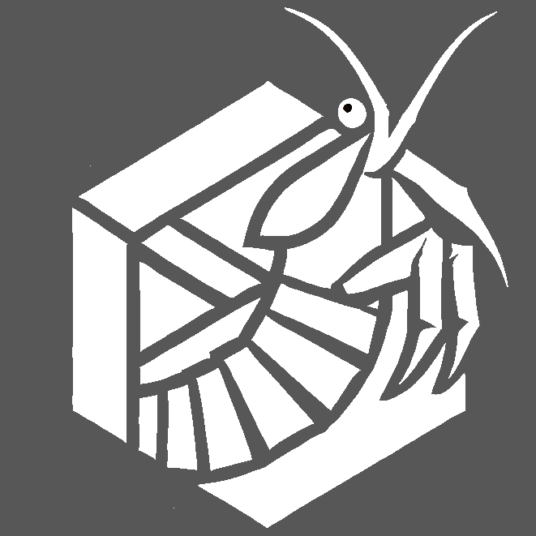

  

# Advanced Image Synthesis Lecture Exercises

This repository contains the programming exercises for the Advanced Image
Synthesis lecture taught by the Computer Graphics and Visualization Group at
the Computer Science Department of the University of Duisburg-Essen.

The exercises introduce the OpenGL-based framework used throughout the course
and then build up a small real-time rendering pipeline step by step. Topics
include basic OpenGL rendering, vertex color interpolation, transformations,
depth testing, rasterization, flat, Gouraud, and Phong shading, texture mapping,
normal mapping, shadow mapping, skyboxes, cubemaps, and environment
reflections.

Most folders contain a self-contained exercise project together with native,
WebAssembly, Visual Studio, and Xcode build support where applicable.

## Repository Structure

- Numbered exercise directories contain the individual lecture exercise projects
- `Utils`: shared teaching framework used by the exercises
- `VS`: shared Visual Studio support files
- `AIS.xcworkspace`: Xcode workspace for the exercise projects
- `makefile`: command-line build entry point for native and WebAssembly builds
- `html`: shared stylesheet, snippet, header, and footer files for exercise pages

Each exercise directory is intended to be understandable on its own, while the
shared code in `Utils` keeps window creation, OpenGL setup, shader handling,
image loading, texture management, camera interaction, and platform differences
out of the core exercise code.

## Building

The repository contains several build setups because the exercises are used in
different teaching environments:

- Makefiles for native and WebAssembly builds
- Visual Studio project files for Windows
- Xcode project files and an Xcode workspace for macOS

To build from the command line, run `make` in an individual exercise directory.
The top-level `makefile` is intended as a batch-build entry point for the
exercise folders. Each exercise folder contains the project-specific source
files, shaders, and assets needed for that exercise. The shared `Utils` folder
contains the small framework used throughout the course.

## License

Copyright (c) 2026 Computer Graphics and Visualization Group, University of
Duisburg-Essen

Permission is hereby granted, free of charge, to any person obtaining a copy of
this software and associated documentation files, to deal in the Software
without restriction, including without limitation the rights to use, copy,
modify, merge, publish, distribute, sublicense, and/or sell copies of the
Software, and to permit persons to whom the Software is furnished to do so,
subject to the following conditions:

The above copyright notice and this permission notice shall be included in all
copies or substantial portions of the Software.

THE SOFTWARE IS PROVIDED AS IS, WITHOUT WARRANTY OF ANY KIND, EXPRESS OR
IMPLIED, INCLUDING BUT NOT LIMITED TO THE WARRANTIES OF MERCHANTABILITY,
FITNESS FOR A PARTICULAR PURPOSE AND NONINFRINGEMENT. IN NO EVENT SHALL THE
AUTHORS OR COPYRIGHT HOLDERS BE LIABLE FOR ANY CLAIM, DAMAGES OR OTHER
LIABILITY, WHETHER IN AN ACTION OF CONTRACT, TORT OR OTHERWISE, ARISING FROM,
OUT OF OR IN CONNECTION WITH THE SOFTWARE OR THE USE OR OTHER DEALINGS IN THE
SOFTWARE.
